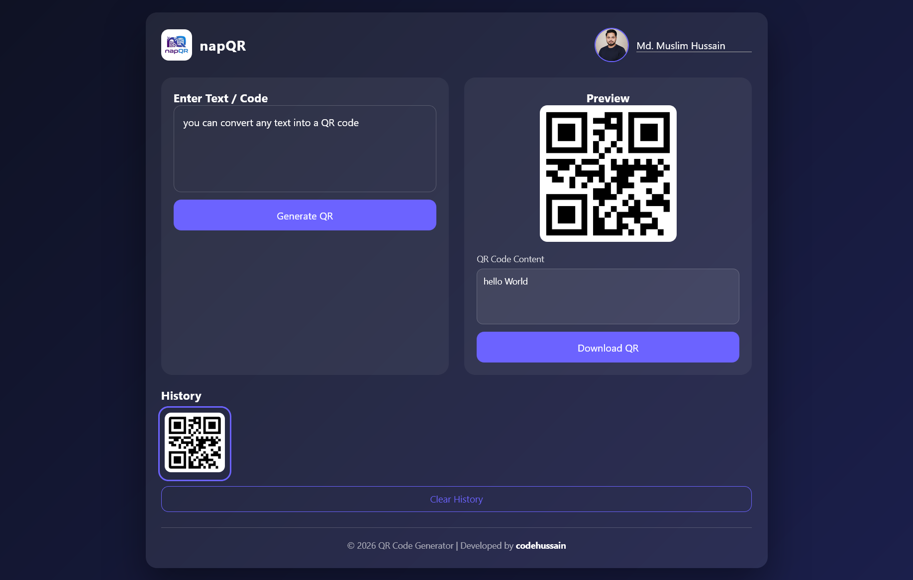
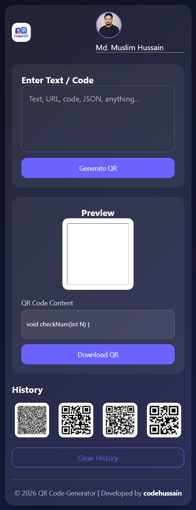

# napQR 

**napQR – Modern QR Code Generator App**  

napQR is a sleek, responsive, and feature-rich **QR code generator** built with **HTML, CSS, and JavaScript**. It allows users to instantly convert any text, code snippet, URL, or data into a QR code, preview it, and download it as an image.

---
### Live Link
[https://napqr-qr-code-generator.vercel.app/](https://napqr-qr-code-generator.vercel.app/)

## Features

- Generate QR codes from **any text, URL, or code**  
- Live **QR preview** with original content displayed  
- **Download QR codes** instantly as PNG  
- **History management** stored in browser `localStorage`  
- Clear history with a single click  
- User **profile support** (username + avatar)  
- Fully **responsive design** for desktop, tablet, and mobile  
- Interactive **hover animations** and modern UI  
- Clean, minimal, professional design with footer credit  

---

## 🛠 Technologies Used

- HTML5  
- CSS3 (Flexbox, Grid, Glassmorphism, Responsive design)  
- JavaScript (ES6)  
- [GoQR API](https://goqr.me/api/) for QR code generation  

---

## Usage

1. Clone the repository or download the project.  
2. Open `index.html` in any modern browser.  
3. Enter text, URL, or code in the input field.  
4. Click **Generate QR** to create a QR code.  
5. Preview the QR code and its content.  
6. Download the QR or select from **history**.  
7. Set your **username and profile picture**.  

---

## Screenshots

- **QR Generation Preview**  
  

- **History Panel**  
  

- **Mobile View**  
  
---

## Developer

**Md Muslim Hussain** – Built with ❤️  
- GitHub: [https://github.com/codehussain-m7l](https://github.com/codehussain-m7l)  
- LinkedIn: [https://linkedin.com/in/codehussain-m7l](https://linkedin.com/in/codehussain-m7l)  

---

## License

This project is **open-source** under the **MIT License** – feel free to use and modify for personal or commercial projects.

---

> **napQR** makes QR code generation fast, easy, and professional – perfect for developers, students, and anyone who needs a reliable QR tool.